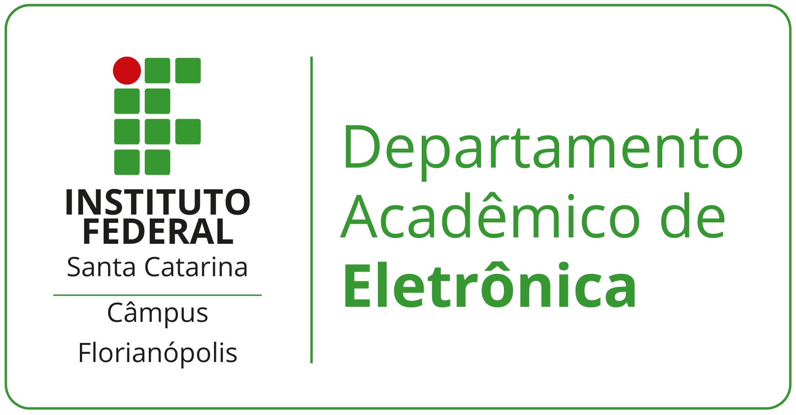

# JIGA DE CONTROLE DE ACESSO

<figure><figcaption></figcaption></figure>

## Resumo

Este projeto tem como objetivo otimizar os processos de teste e desenvolvimento do software _Defense IA_, por meio da implementação de uma solução na área da eletrônica, utilizando equipamentos e integração com motor de passo, driver de motor e sistemas embarcados.

## Introdução

### Definição do Problema

O módulo de controle de acesso do _Defense IA_ integra-se a dispositivos físicos, como controladoras de acesso. Um dos principais desafios enfrentados pela equipe de desenvolvimento é a limitação de testes físicos, especialmente para colaboradores em regime remoto, que não conseguem realizar a leitura de cartões nos dispositivos para gerar eventos no sistema. Além disso, há a necessidade de realizar testes de carga, simulando acessos em massa, com volumes superiores a 1 milhão de registros, para avaliar a performance e a capacidade do banco de dados em armazenar e processar eventos de acesso. Este projeto concentra-se na resolução de dois problemas principais:

* Simulação de eventos de acesso por meio da ativação remota da passagem de cartões nos dispositivos,  através de uma interface web, permitindo a execução de testes mesmo em ambientes fora do laboratório, como no trabalho remoto.
* Testes de performance voltados para a validação da escalabilidade e da robustez do banco de dados, por meio da simulação de grandes volumes de eventos, superiores a 1 milhão de registros, com o objetivo de avaliar a capacidade de armazenamento, processamento e resposta do sistema sob carga intensa.

### Motivação do Projeto

A motivação central é o desenvolvimento de uma JIGA de testes que possa ser integrada à esteira de desenvolvimento do _Defense IA_. Essa JIGA utilizará dispositivos eletrônicos motor de passo, driver de motor e sistemas embarcados para simular fisicamente a passagem de cartões nos leitores, gerando eventos reais no sistema. O projeto representa uma aplicação prática de conhecimentos acadêmicos e técnicos, com potencial de impacto direto na eficiência dos testes e na qualidade do produto final. A integração entre hardware e software permitirá a automação de testes e a ampliação da cobertura de cenários, contribuindo para a evolução contínua da solução.

## Objetivos

### Objetivo Geral

Desenvolver uma JIGA de testes para o módulo de controle de acesso do software Defense IA, integrando conhecimentos de eletrônica e desenvolvimento de software, com o propósito de solucionar limitações nos testes físicos e de performance enfrentadas pela equipe.

### Objetivos específicos

* Montar fisicamente a JIGA de testes.
* Integrar sistema embarcado com motor de passo e cartão de acesso.
* Desenvolver interface web para controle remoto.
* Implementar controle de temperatura e acionamento de ventoinha.

## Metodologia

Este trabalho utiliza a metodologia de Pesquisa-Ação, por ser adequada à investigação de problemas reais com aplicação prática de soluções. A Pesquisa-Ação é caracterizada pela integração entre a produção de conhecimento e a intervenção no contexto estudado, permitindo que o pesquisador atue diretamente na realidade observada. O processo metodológico foi dividido em quatro etapas principais:&#x20;

(1) diagnóstico do problema, por meio de levantamento bibliográfico e observação prática;&#x20;

(2) planejamento da ação, com definição das estratégias e recursos necessários para o desenvolvimento do projeto físico;&#x20;

(3) implementação, onde o conhecimento sintetizado foi aplicado na construção e execução do projeto; e&#x20;

(4) avaliação e reflexão, com análise dos resultados obtidos e apresentação das conclusões aos professores.

<a href="arquitetura-do-projeto.md" class="button secondary" data-icon="sitemap">Arquitetura do projeto</a>

<a href="materiais-utilizados/" class="button secondary" data-icon="microchip">  Materiais Utilizados  </a>

<a href="desenvolvimento-do-projeto.md" class="button secondary" data-icon="uncharted">Desenvolvimento do projeto</a>

