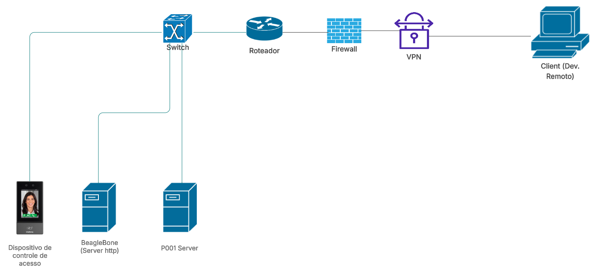
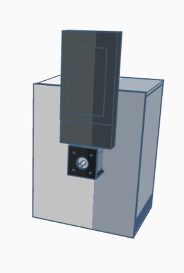
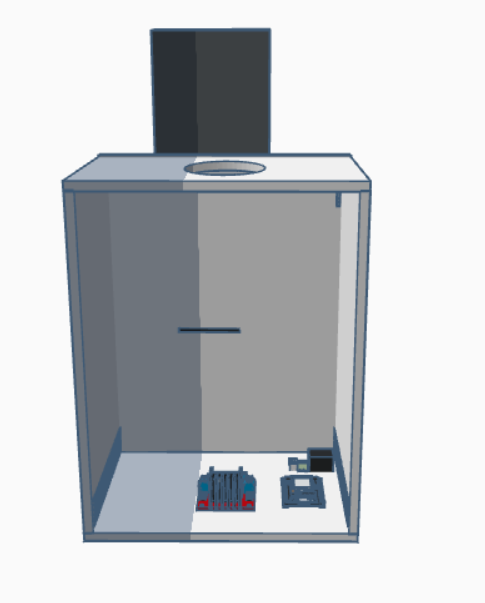

# Planejamento da ação

## Planejamento da ação

Para resolver os problemas apresentados será realizado o projeto com duas principais ações.

A primeira é disponibilizar uma interface web para o trabalhador remoto conseguir gerar um acesso de forma remota.

A segunda é disponibilizar uma função na interface web para gerar 20.000.000 de eventos de forma ininterrupta identificar quantos eventos foram gerados e parar.

### Diagrama de rede

O ambiente de rede proposto será estruturado conforme os seguintes critérios:

* O Servidor P001, a BeagleBone e o dispositivo de controle de acesso permanecerão conectados a um mesmo switch, compondo uma rede LAN dedicada.
* O switch terá conexão direta com o roteador, viabilizando o tráfego interno e externo conforme as regras estabelecidas.
* Será implementada uma política de segurança no firewall visando bloquear solicitações provenientes de endereços IP não autorizados. Somente conexões previamente reconhecidas terão permissão para acessar os serviços disponibilizados na rede interna.
* Uma conexão VPN (Virtual Private Network) será estabelecida entre o ambiente do cliente e a infraestrutura local, garantindo um túnel seguro para o envio de comandos ao servidor HTTP operante na BeagleBone.

O diagrama de rede correspondente encontra-se apresentado a seguir:

<figure><figcaption></figcaption></figure>

***

### Diagrama de conexões físicas

A arquitetura física do sistema será segmentada em dois níveis principais:

* **Conexões em nível micro**: integração entre a BeagleBone, o sensor de temperatura GY-906, o driver de motor DRV8825, motor de passo NEMA17, responsável pela operação eletromecânica.
* **Conexões em nível macro**: interligação entre o Servidor P001, o dispositivo de controle de acesso e a BeagleBone, compondo a infraestrutura de comunicação do projeto.

O esquema a seguir apresenta o detalhamento das conexões físicas entre a BeagleBone, o sensor de temperatur GY-906, o driver DRV8825 e o motor de passo NEMA17.

<figure><figcaption></figcaption></figure>

## Projeto em 3D da Jiga

Nesta seção é apresentada a modelagem tridimensional desenvolvida no Tinkercad, com o objetivo de representar a disposição física dos principais componentes na Jiga. Foi elaborado um esquema visual contemplando o driver de motor, a BeagleBone, o motor de passo, o dispositivo de controle de acesso e o cartão de acesso, permitindo avaliar o posicionamento e a organização estrutural do conjunto.

Vale destacar que o Servidor P001 não foi incluído na representação, uma vez que encontra-se hospedado no datacenter.

<figure><figcaption></figcaption></figure>

Face 2:

<figure><figcaption></figcaption></figure>
