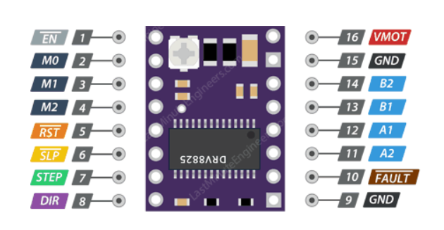
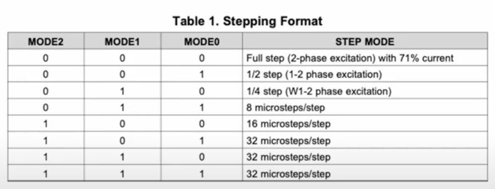

# Driver de motor (DRV 8825)

O driver de motor selecionado para o projeto é o DRV8825, que apresenta faixa de tensão de alimentação para o motor entre 8,25 V e 45 V. O componente suporta uma corrente contínua por fase de até 1,5 A e uma corrente de pico máxima de 2,2 A. A tensão lógica de controle opera entre 2,2 V e 5 V, garantindo compatibilidade com diferentes níveis de sinal de microcontroladores.

## Pinos

<figure><figcaption></figcaption></figure>

| Número | Nome   | Descrição                               |
| ------ | ------ | --------------------------------------- |
| 1      | ENABLE | Habilita o driver                       |
| 2      | M0     | Seleciona o modo de operação do driver  |
| 3      | M1     | Seleciona o modo de operação do driver  |
| 4      | M2     | Seleciona o modo de operação do driver  |
| 5      | Reset  | Reset na lógica                         |
| 6      | Sleep  | Ativar baixo consumo de corrente        |
| 7      | STEP   | Envia os pulsos                         |
| 8      | DIR    | Seleciona direção Horário/Anti-horário  |
| 9      | GND    | GND lógico                              |
| 10     | FAULT  | Indica a falha caso tenha sobrecorrente |
| 11     | A1     | Saída da bobina A                       |
| 12     | A2     | Saída da bobina A                       |
| 13     | B1     | Saída da bobina B                       |
| 14     | B2     | Saída da bobina B                       |
| 15     | GND    | GND do motor                            |
| 16     | VMOT   | Alimentação do motor                    |

### Modo de operação

O driver de motor suporta até 32 microsteps, sendo a resolução configurável por meio dos pinos M0, M1 e M2. A definição do modo de operação deve ser realizada conforme as combinações apresentadas na tabela abaixo.

<figure><figcaption></figcaption></figure>

## Ajuste de corrente de saída

O driver possui um potenciômetro de ajuste que permite regular a corrente de saída fornecida ao motor de passo. Esse ajuste deve ser realizado de acordo com a corrente nominal do motor utilizado, de forma a garantir desempenho adequado e evitar sobreaquecimento.\
A corrente de referência (Vref) pode ser medida entre o pino do potenciômetro e o GND, conforme a fórmula apresentada abaixo para o cálculo da corrente de saída.

$$
I = Vref/5*Rsense
$$

$$
I = Vref/5*0.1
$$

$$
I = Vref*2
$$
