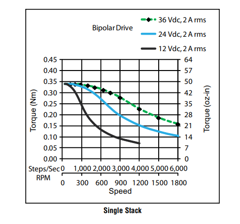

# Motor de passo (NEMA 17)

O motor de passo selecionado para o projeto é do tipo NEMA 17, um motor bipolar que opera em uma faixa de tensão entre 12 V e 26 V, realizando 200 passos por rotação completa. Além disso, o modelo é compatível com o driver especificado para o sistema.

## Gráfico Torque x RPM

Para a aplicação em questão, não há necessidade de alta velocidade de rotação nem de elevado torque.&#x20;

Conforme indicado no datasheet do fabricante, a tensão de operação deve ser definida de acordo com a velocidade e o torque exigidos pelo motor durante o funcionamento.

<figure><figcaption></figcaption></figure>

Considerando que o projeto não demanda um torque elevado, foi adotada uma tensão de trabalho de 15 V, valor adequado para atender aos requisitos operacionais da aplicação.
